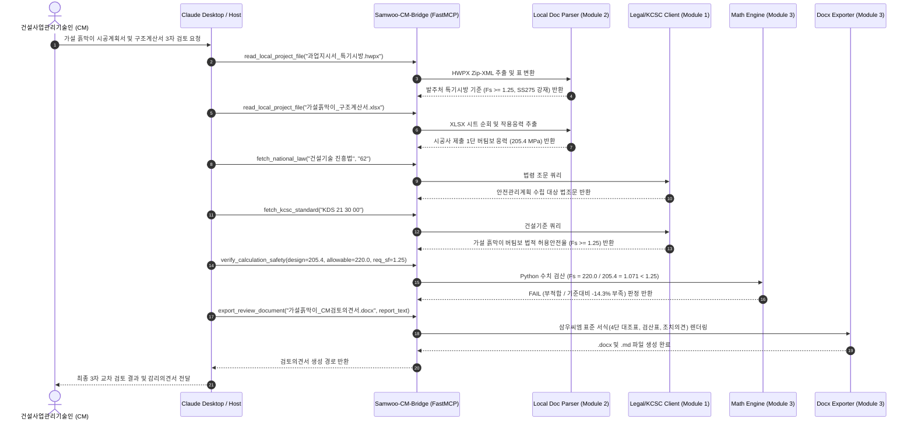

# [Samwoo-CM-Bridge] System Architecture & Specification

## 1. 개요 (Overview)
**Samwoo-CM-Bridge**는 삼우씨엠 사내 AI 활용 아이디어 공모전 [Track 2: 외부 AI 활용 아이디어 부문]에 최적화된 CM 전용 3자 교차 검토 MCP(Model Context Protocol) 엔진입니다.

```
+-------------------------------------------------------------------------------+
|                 [사용자 인터페이스 (UI / Host Client)]                         |
|                 Claude Desktop / OpenClaw / Cursor / Agent                     |
|                                                                               |
|  - 사용자 질의 수신                                                           |
|  - 하네스 규칙(RULES.md) 주입: 조항 번호/수치 날조 원천 차단 (Zero-Hallucination)  |
+---------------------------------------+---------------------------------------+
                                        | (1) Stdio (표준 입출력 프로토콜)
                                        v
+-------------------------------------------------------------------------------+
|                     [Samwoo-CM-Bridge (FastMCP Server)]                       |
|                                                                               |
|  +-------------------------------------------------------------------------+  |
|  | Module 1. 외부 실시간 OpenAPI 커넥터 (External Legal & Standard Bridge)  |  |
|  |  - 국가법령정보센터 API: 건축법, 주택법, 건진법 조문 실시간 검색        |  |
|  |  - 국가건설기준센터(KCSC) API: KDS(설계기준), KCS(표준시방서) 규격 추출   |  |
|  |  - Offline Mock/Cache Fallback: 심사 및 오프라인 환경 100% 무결성 보장  |  |
|  +-------------------------------------------------------------------------+  |
|  +-------------------------------------------------------------------------+  |
|  | Module 2. 로컬 보안 다차원 문서 파서 (Local Multi-Format Document Parser) |  |
|  |  - Path Traversal 차단 격리 샌드박스 (secure_local_data/)                 |  |
|  |  - HWPX: Hancom Zip-XML 파싱 (단락 및 hp:tbl 표 마크다운 구조화)         |  |
|  |  - XLSX: openpyxl 기반 Sheet별 매트릭스 변환 및 수치 셀 JSON 추출        |  |
|  |  - DOCX / PPTX / PDF / TXT: 슬라이드 및 문단별 텍스트 정제                |  |
|  +-------------------------------------------------------------------------+  |
|  +-------------------------------------------------------------------------+  |
|  | Module 3. 다분야 수치 검산 & 리포트 생성기 (Math Verifier & Exporter)   |  |
|  |  - 5대 공종(토목/구조, 기계/설비, 소방, 전기/통신, 건축) 공식 레지스트리  |  |
|  |  - Python AST 기반 안전 커스텀 수식 검산 (Deterministic PASS/FAIL)        |  |
|  |  - 삼우씨엠 표준 서식 기반 감리의견서(Word .docx / Markdown .md) 자동 생성|  |
|  +-------------------------------------------------------------------------+  |
+-------------------+---------------------------------------+-------------------+
                    |                                       |
                    v (2) 외부 HTTP 요청                    v (3) 로컬 파일 I/O (격리)
+---------------------------------------+ +-------------------------------------+
|       [공공데이터 OpenAPI 서버]        | |     [로컬 작업 디렉토리 (보안)]      |
|   - 국가법령정보공동활용 (law.go.kr)   | |   ./secure_local_data/              |
|   - 국가건설기준센터 (kcsc.re.kr)      | |   |- 발주처_특기시방서.hwpx          |
|                                       | |   |- 가설구조계산서.xlsx            |
|                                       | |   `- 감리의견서_초안.docx (출력)    |
+---------------------------------------+ +-------------------------------------+
```

---

## 2. 3자 교차 검증 파이프라인 시퀀스 (Sequence Flow)



---

## 3. 모듈별 기술 세부사항

### Module 1: 법령 및 KCSC 기준 연동 (`openapi_client.py`)
- **실시간 API 연동**: `law.go.kr` 및 `kcsc.re.kr` REST API를 통해 실시간 조문 텍스트 추출.
- **Mock/Cache Fallback**: API 키가 없거나 네트워크가 차단된 오프라인 환경에서도 `data_cache/`를 통해 검증된 법령/KDS 기준을 즉각 반환하여 데모 무결성 보장.

### Module 2: 로컬 다차원 문서 파서 (`doc_parser.py`)
- **보안 샌드박스**: `Path.resolve().is_relative_to(SECURE_DATA_DIR)`를 통해 경로 트래버설 공격 방어.
- **HWPX 지원**: 한글 표준 문서(HWPX)의 Zip-XML 구조에서 `hp:tbl`, `hp:tr`, `hp:tc`를 순회하여 마크다운 표 및 단락 텍스트 완벽 복원.
- **XLSX / DOCX / PPTX / PDF 지원**: 수치 데이터 시트 및 프레젠테이션, 문서 텍스트 정밀 추출.

### Module 3: 다분야 수치 검산 및 리포트 생성기 (`formula_engine.py`, `docx_exporter.py`)
- **5대 공종 지원**:
  1. 토목/구조: 버팀보 축력 및 좌굴, 지반 앵커 인장, 히빙/보일링, 전도/활동 안전율
  2. 기계/설비: 펌프 양정 여유율, 배관 마찰손실, 필요 환기량
  3. 소방: 옥내소화전/스프링클러 유효수량, 헤드 방수량 ($K\sqrt{10P}$), 제연풍량
  4. 전기/통신: 3상/단상 선로 전압강하율, 변압기 부하율 및 수용률, 케이블 허용전류
  5. 건축: 외벽 열관류율($U$-value), 단열재 두께 기준, 직통계단 보행거리
- **AST Safe Eval**: 악의적 코드 실행 없이 순수 공학 수식만을 안전하게 동적 연산.
- **삼우씨엠 표준 Word 리포트**: Navy 색상 헤더, 4단 3자 대조표, PASS/FAIL 상태 배지, 공식 날인 서식 자동 반영.

---

## 4. 사내 AI 시스템(SAI)으로의 이식성
본 MCP 서버의 코어 로직(`src/samwoo_cm_bridge/core/`)은 FastMCP와 완전히 디커플링되어 있어, 사내 건설특화 AI(SAI) 백엔드(FastAPI)의 서비스 모듈로 코드 수정 없이 100% 즉각 임포트 및 재사용이 가능합니다.
